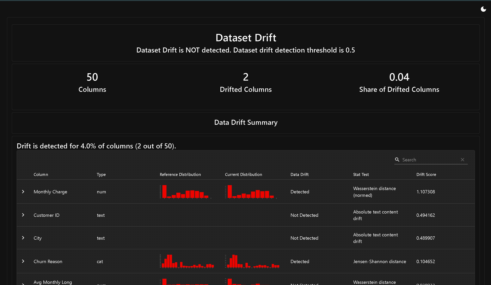

# End-to-End Customer Churn Prediction System 🚀

## 📌 Project Overview
This project is a complete, production-ready Machine Learning system that predicts telecommunications customer churn. Designed with strong software engineering principles, it encompasses the entire ML lifecycle: data preprocessing, experiment tracking, REST API deployment, containerization, and continuous data drift monitoring.

---

## 📸 Production Monitoring Showcase

*Automated detection of statistical data drift to monitor model degradation in production using Evidently AI.*

*(Note: Save your HTML screenshot as `drift_report.png` inside an `images` folder)*

---

## 🏢 Business Problem & Evaluation Strategy

### The Objective
Identify customers who are at high risk of canceling their subscriptions so the business can intervene with targeted retention offers.

### Sensible Business Metrics
Accuracy is a flawed metric for imbalanced datasets like churn. Instead, this system is evaluated on:
*   **Recall (~0.90):** Out of all customers who *actually* churned, how many did the model successfully catch? **This is the primary metric.** Missing a churning customer (False Negative) results in total loss of revenue, which is the most expensive error for the business.
*   **Precision (~0.77):** Out of all customers predicted to churn, how many actually did? While important, accidentally giving a retention discount to a happy customer (False Positive) is far cheaper than losing a customer entirely.

---

## 🏗️ System Architecture & Lifecycle

### 1. Experiment Tracking (MLflow)
Instead of relying on scattered Jupyter Notebook cells, all model training runs (using Random Forest) are tracked via **MLflow**. This logs hyperparameters, model artifacts, and evaluation metrics to ensure full reproducibility.

### 2. API Deployment (FastAPI)
The final model is served via a high-performance **FastAPI** backend. It uses **Pydantic** to strictly validate incoming JSON payloads, automatically aligning incoming customer features to the exact schema the model expects.

### 3. Containerization (Docker)
To eliminate environment inconsistencies and prepare the application for cloud deployment, the entire API and its dependencies are packaged into an isolated Linux environment using a custom `Dockerfile`.

### 4. Monitoring & Data Drift (Evidently AI)
Machine learning models degrade over time as real-world behaviors change. 
*   **Data Drift Handling:** This system uses **Evidently AI** to compare the statistical distribution of incoming production data against the original training baseline (e.g., detecting if the average `Monthly Charge` suddenly shifts).
*   **Degradation Detection:** By continuously logging prediction distributions, the system alerts engineers when the model's outputs deviate significantly from historical norms.

### 5. Retraining Strategy
The system is designed to trigger a retraining pipeline under two conditions:
1.  **Time-Based:** Automated retraining every 30 days to capture recent seasonal trends.
2.  **Drift-Based:** Immediate retraining triggered if the Evidently AI dashboard detects statistical drift (P-value < 0.05) in core features like `Monthly Charge` or `Tenure`.

---

## 🚀 How to Run Locally

### 1. Setup the Environment
```bash
python -m venv venv
source venv/bin/activate  # On Windows use: venv\Scripts\activate
pip install -r requirements.txt

```

### 2. View MLflow Experiments

```bash
mlflow ui

```

*Navigate to `http://localhost:5000` to view the training logs.*

### 3. Run the API locally

```bash
uvicorn main:app --reload

```

*Navigate to `http://127.0.0.1:8000/docs` to test the `/predict` endpoint interactively.*

### 4. Build and Run via Docker

```bash
docker build -t churn-predictor-api .
docker run -p 8000:8000 churn-predictor-api

```

### 5. Generate Data Drift Report

```bash
python monitor_drift.py

```

*Open the generated `data_drift_report.html` file in your browser to view the interactive dashboard.*

```